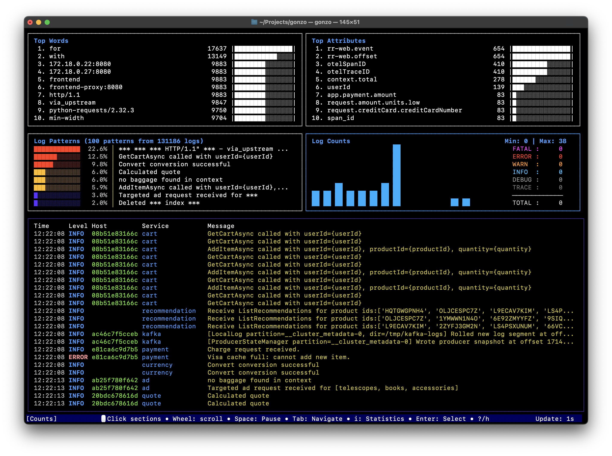
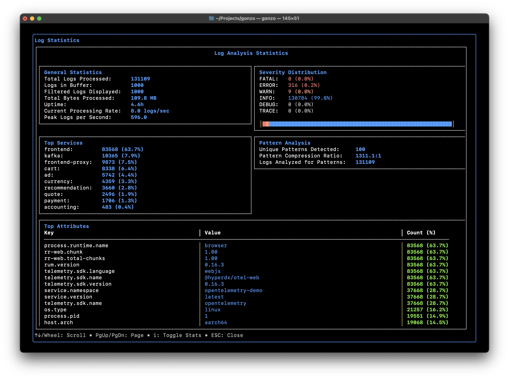
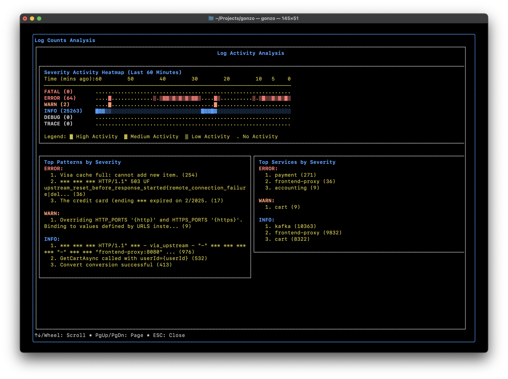

# Gonzo - The Go based TUI for log analysis
<p align="center"></p>

[](https://go.dev/)
[](https://opensource.org/licenses/MIT)
[](https://github.com/yourusername/gonzo/pulls)

A powerful, real-time log analysis terminal UI inspired by k9s. Analyze log streams with beautiful charts, AI-powered insights, and advanced filtering - all from your terminal.

### See it in action


### Main Dashboard


### Stats and Info


### Everyone loves a heatmap



## ✨ Features

### 🎯 Real-Time Analysis
- **Live streaming** - Process logs as they arrive from stdin, files, or network
- **OTLP native** - First-class support for OpenTelemetry log format
- **OTLP receiver** - Built-in gRPC server to receive logs via OpenTelemetry protocol
- **Format detection** - Automatically detects JSON, logfmt, and plain text
- **Severity tracking** - Color-coded severity levels with distribution charts

### 📈 Interactive Dashboard
- **k9s-inspired layout** - Familiar 2x2 grid interface
- **Real-time charts** - Word frequency, attributes, severity distribution, and time series
- **Keyboard + mouse navigation** - Vim-style shortcuts plus click-to-navigate and scroll wheel support
- **Smart log viewer** - Auto-scroll with intelligent pause/resume behavior
- **Global pause control** - Spacebar pauses entire dashboard while buffering logs
- **Modal details** - Deep dive into individual log entries with expandable views
- **Log Counts analysis** - Detailed modal with heatmap visualization, pattern analysis by severity, and service distribution
- **AI analysis** - Get intelligent insights about log patterns and anomalies with configurable models

### 🔍 Advanced Filtering
- **Regex support** - Filter logs with regular expressions
- **Attribute search** - Find logs by specific attribute values
- **Severity filtering** - Focus on errors, warnings, or specific log levels
- **Interactive selection** - Click or keyboard navigate to explore logs

### 🤖 AI-Powered Insights
- **Pattern detection** - Automatically identify recurring issues
- **Anomaly analysis** - Spot unusual patterns in your logs  
- **Root cause suggestions** - Get AI-powered debugging assistance
- **Configurable models** - Choose from GPT-4, GPT-3.5, or any custom model
- **Multiple providers** - Works with OpenAI, LM Studio, Ollama, or any OpenAI-compatible API
- **Local AI support** - Run completely offline with local models

## 🚀 Quick Start

### Installation

#### Using Go
```bash
go install github.com/control-theory/gonzo/cmd@latest
```

#### Using Homebrew (macOS/Linux)
```bash
brew tap control-theory/gonzo
brew install gonzo
```

#### Download Binary
Download the latest release for your platform from the [releases page](https://github.com/control-theory/gonzo/releases).

#### Build from Source
```bash
git clone https://github.com/control-theory/gonzo.git
cd gonzo
make build
```

## 📖 Usage

### Basic Usage

```bash
# Read logs directly from files
gonzo -f application.log

# Read from multiple files
gonzo -f application.log -f error.log -f debug.log

# Use glob patterns to read multiple files
gonzo -f "/var/log/*.log"
gonzo -f "/var/log/app/*.log" -f "/var/log/nginx/*.log"

# Follow log files in real-time (like tail -f)
gonzo -f /var/log/app.log --follow
gonzo -f "/var/log/*.log" --follow

# Analyze logs from stdin (traditional way)
cat application.log | gonzo

# Stream logs from kubectl
kubectl logs -f deployment/my-app | gonzo

# Follow system logs
tail -f /var/log/syslog | gonzo

# Analyze Docker container logs
docker logs -f my-container 2>&1 | gonzo

# With AI analysis (requires API key)
export OPENAI_API_KEY=sk-your-key-here
gonzo -f application.log --ai-model="gpt-4"
```

### OTLP Network Receiver

Gonzo can receive logs directly via OpenTelemetry Protocol (OTLP) over both gRPC and HTTP:

```bash
# Start Gonzo as an OTLP receiver (both gRPC on port 4317 and HTTP on port 4318)
gonzo --otlp-enabled

# Use custom ports
gonzo --otlp-enabled --otlp-grpc-port=5317 --otlp-http-port=5318

# gRPC endpoint: localhost:4317
# HTTP endpoint: http://localhost:4318/v1/logs
```

#### Example: OpenTelemetry Collector Configuration

**Using gRPC:**
```yaml
exporters:
  otlp/gonzo_grpc:
    endpoint: localhost:4317
    tls:
      insecure: true

service:
  pipelines:
    logs:
      receivers: [your_receivers]
      processors: [your_processors]
      exporters: [otlp/gonzo_grpc]
```

**Using HTTP:**
```yaml
exporters:
  otlphttp/gonzo_http:
    endpoint: http://localhost:4318/v1/logs

service:
  pipelines:
    logs:
      receivers: [your_receivers]
      processors: [your_processors]
      exporters: [otlphttp/gonzo_http]
```

#### Example: Python Application

**Using gRPC:**
```python
from opentelemetry.exporter.otlp.proto.grpc._log_exporter import OTLPLogExporter

exporter = OTLPLogExporter(
    endpoint="localhost:4317",
    insecure=True
)
```

**Using HTTP:**
```python
from opentelemetry.exporter.otlp.proto.http._log_exporter import OTLPLogExporter

exporter = OTLPLogExporter(
    endpoint="http://localhost:4318/v1/logs",
)
```

See `examples/send_otlp_logs.py` for a complete example.

### With AI Analysis

```bash
# Auto-select best available model (recommended) - file input
export OPENAI_API_KEY=sk-your-key-here
gonzo -f logs.json

# Or specify a particular model - file input
export OPENAI_API_KEY=sk-your-key-here
gonzo -f logs.json --ai-model="gpt-4"

# Follow logs with AI analysis
export OPENAI_API_KEY=sk-your-key-here
gonzo -f "/var/log/app.log" --follow --ai-model="gpt-4"

# Using local LM Studio (auto-selects first available)
export OPENAI_API_KEY="local-key"
export OPENAI_API_BASE="http://localhost:1234/v1"
gonzo -f logs.json

# Using Ollama (auto-selects best model like gpt-oss:20b)
export OPENAI_API_KEY="ollama"
export OPENAI_API_BASE="http://localhost:11434"
gonzo -f logs.json --follow

# Traditional stdin approach still works
export OPENAI_API_KEY=sk-your-key-here
cat logs.json | gonzo --ai-model="gpt-4"
```

### Keyboard Shortcuts

#### Navigation
| Key/Mouse | Action |
|-----------|--------|
| `Tab` / `Shift+Tab` | Navigate between panels |
| `Mouse Click` | Click on any section to switch to it |
| `↑`/`↓` or `k`/`j` | Move selection up/down |
| `Mouse Wheel` | Scroll up/down to navigate selections |
| `←`/`→` or `h`/`l` | Horizontal navigation |
| `Enter` | View log details or open analysis modal (Counts section) |
| `ESC` | Close modal/cancel |

#### Actions  
| Key | Action |
|-----|--------|
| `Space` | Pause/unpause entire dashboard |
| `/` | Enter filter mode (regex supported) |
| `s` | Search and highlight text in logs |
| `c` | Toggle Host/Service columns in log view |
| `r` | Reset all data (manual reset) |
| `u` / `U` | Cycle update intervals (forward/backward) |
| `i` | AI analysis (in detail view) |
| `m` | Switch AI model (shows available models) |
| `?` / `h` | Show help |
| `q` / `Ctrl+C` | Quit |

#### Log Viewer Navigation
| Key | Action |
|-----|--------|
| `Home` | Jump to top of log buffer (stops auto-scroll) |
| `End` | Jump to latest logs (resumes auto-scroll) |
| `PgUp` / `PgDn` | Navigate by pages (10 entries at a time) |
| `↑`/`↓` or `k`/`j` | Navigate entries with smart auto-scroll |

#### AI Chat (in log detail modal)
| Key | Action |
|-----|--------|
| `c` | Start chat with AI about current log |
| `Tab` | Switch between log details and chat pane |
| `m` | Switch AI model (works in modal too) |

### Log Counts Analysis Modal

Press `Enter` on the Counts section to open a comprehensive analysis modal featuring:

#### 🔥 Real-Time Heatmap Visualization
- **Time-series heatmap** showing severity levels vs. time (1-minute resolution)
- **60-minute rolling window** with automatic scaling per severity level
- **Color-coded intensity** using ASCII characters (░▒▓█) with gradient effects
- **Precise alignment** with time headers showing minutes ago (60, 50, 40, ..., 10, 0)
- **Receive time architecture** - visualization based on when logs were received for reliable display

#### 🔍 Pattern Analysis by Severity
- **Top 3 patterns per severity** using drain3 pattern extraction algorithm
- **Severity-specific tracking** with dedicated drain3 instances for each level
- **Real-time pattern detection** as logs arrive and are processed
- **Accurate pattern counts** maintained separately for each severity level

#### 🏢 Service Distribution Analysis  
- **Top 3 services per severity** showing which services generate each log level
- **Service name extraction** from common attributes (service.name, service, app, etc.)
- **Real-time updates** as new logs are processed and analyzed
- **Fallback to host information** when service names are not available

#### ⌨️ Modal Navigation
- **Scrollable content** using mouse wheel or arrow keys
- **ESC to close** and return to main dashboard
- **Full-width display** maximizing screen real estate for data visualization
- **Real-time updates** - data refreshes automatically as new logs arrive

The modal uses the same receive time architecture as the main dashboard, ensuring consistent and reliable visualization regardless of log timestamp accuracy or clock skew issues.

## ⚙️ Configuration

### Command Line Options

```bash
gonzo [flags]
gonzo [command]

Commands:
  version     Print version information
  help        Help about any command
  completion  Generate shell autocompletion

Flags:
  -f, --file stringArray           Files or file globs to read logs from (can specify multiple)
  --follow                     Follow log files like 'tail -f' (watch for new lines in real-time)
  -u, --update-interval duration   Dashboard update interval (default: 1s)
  -b, --log-buffer int             Maximum log entries to keep (default: 1000)
  -m, --memory-size int            Maximum frequency entries (default: 10000)
  --ai-model string            AI model for analysis (auto-selects best available if not specified)
  -t, --test-mode                  Run without TTY for testing
  -v, --version                    Print version information
  --config string              Config file (default: $HOME/.config/gonzo/config.yml)
  -h, --help                       Show help message
```

### Configuration File

Create `~/.config/gonzo/config.yml` for persistent settings:

```yaml
# File input configuration
files:
  - "/var/log/app.log"
  - "/var/log/error.log"
  - "/var/log/*.log"  # Glob patterns supported
follow: true  # Enable follow mode (like tail -f)

# Update frequency for dashboard refresh
update-interval: 2s

# Buffer sizes
log-buffer: 2000
memory-size: 15000

# Development/testing
test-mode: false

# AI configuration
ai-model: "gpt-4"
```

See [examples/config.yaml](examples/config.yaml) for a complete configuration example with detailed comments.

### AI Configuration

Gonzo supports multiple AI providers for intelligent log analysis. Configure using command line flags and environment variables. You can switch between available models at runtime using the `m` key.

#### OpenAI
```bash
# Set your API key
export OPENAI_API_KEY="sk-your-actual-key-here"

# Auto-select best available model (recommended)
cat logs.json | gonzo

# Or specify a particular model
cat logs.json | gonzo --ai-model="gpt-4"
```

#### LM Studio (Local AI)
```bash
# 1. Start LM Studio server with a model loaded
# 2. Set environment variables (IMPORTANT: include /v1 in URL)
export OPENAI_API_KEY="local-key"
export OPENAI_API_BASE="http://localhost:1234/v1"

# Auto-select first available model (recommended)
cat logs.json | gonzo

# Or specify the exact model name from LM Studio
cat logs.json | gonzo --ai-model="openai/gpt-oss-120b"
```

#### Ollama (Local AI)
```bash
# 1. Start Ollama: ollama serve
# 2. Pull a model: ollama pull gpt-oss:20b
# 3. Set environment variables (note: no /v1 suffix needed)
export OPENAI_API_KEY="ollama"
export OPENAI_API_BASE="http://localhost:11434"

# Auto-select best model (prefers gpt-oss, llama3, mistral, etc.)
cat logs.json | gonzo

# Or specify a particular model
cat logs.json | gonzo --ai-model="gpt-oss:20b"
cat logs.json | gonzo --ai-model="llama3"
```

#### Custom OpenAI-Compatible APIs
```bash
# For any OpenAI-compatible API endpoint
export OPENAI_API_KEY="your-api-key"
export OPENAI_API_BASE="https://api.your-provider.com/v1"
cat logs.json | gonzo --ai-model="your-model-name"
```

#### Runtime Model Switching

Once Gonzo is running, you can switch between available AI models without restarting:

1. **Press `m`** anywhere in the interface to open the model selection modal
2. **Navigate** with arrow keys, page up/down, or mouse wheel
3. **Select** a model with Enter
4. **Cancel** with Escape

The model selection modal shows:
- All available models from your configured AI provider
- Current active model (highlighted in green)
- Dynamic sizing based on terminal height
- Scroll indicators when there are many models

**Note:** Model switching requires the AI service to be properly configured and running. The modal will only appear if models are available from your AI provider.

#### Auto Model Selection

When you don't specify the `--ai-model` flag, Gonzo automatically selects the best available model:

**Selection Priority:**
1. **OpenAI**: Prefers `gpt-4` → `gpt-3.5-turbo` → first available
2. **Ollama**: Prefers `gpt-oss:20b` → `llama3` → `mistral` → `codellama` → first available  
3. **LM Studio**: Uses first available model from the server
4. **Other providers**: Uses first available model

**Benefits:**
- ✅ No need to know model names beforehand
- ✅ Works immediately with any AI provider
- ✅ Intelligent defaults for better performance
- ✅ Still allows manual model selection with `m` key

**Example:** Instead of `gonzo --ai-model="llama3"`, simply run `gonzo` and it will auto-select `llama3` if available.

#### Troubleshooting AI Setup

**LM Studio Issues:**
- ✅ Ensure server is running and model is loaded
- ✅ Use full model name: `--ai-model="openai/model-name"`
- ✅ Include `/v1` in base URL: `http://localhost:1234/v1`
- ✅ Check available models: `curl http://localhost:1234/v1/models`

**Ollama Issues:**
- ✅ Start server: `ollama serve`
- ✅ Verify model: `ollama list`
- ✅ Test API: `curl http://localhost:11434/api/tags`
- ✅ Use correct URL: `http://localhost:11434` (no `/v1` suffix)
- ✅ Model names include tags: `gpt-oss:20b`, `llama3:8b`

**OpenAI Issues:**
- ✅ Verify API key is valid and has credits
- ✅ Check model availability (gpt-4 requires API access)

### Environment Variables

| Variable | Description |
|----------|-------------|
| `OPENAI_API_KEY` | API key for AI analysis (required for AI features) |
| `OPENAI_API_BASE` | Custom API endpoint (default: https://api.openai.com/v1) |
| `GONZO_FILES` | Comma-separated list of files/globs to read (equivalent to -f flags) |
| `GONZO_FOLLOW` | Enable follow mode (true/false) |
| `GONZO_UPDATE_INTERVAL` | Override update interval |
| `GONZO_LOG_BUFFER` | Override log buffer size |
| `GONZO_MEMORY_SIZE` | Override memory size |
| `GONZO_AI_MODEL` | Override default AI model |
| `GONZO_TEST_MODE` | Enable test mode |
| `NO_COLOR` | Disable colored output |

### Shell Completion

Enable shell completion for better CLI experience:

```bash
# Bash
source <(gonzo completion bash)

# Zsh  
source <(gonzo completion zsh)

# Fish
gonzo completion fish | source

# PowerShell
gonzo completion powershell | Out-String | Invoke-Expression
```

For permanent setup, save the completion script to your shell's completion directory.

## 🏗️ Architecture

Gonzo is built with:
- **[Bubble Tea](https://github.com/charmbracelet/bubbletea)** - Terminal UI framework
- **[Lipgloss](https://github.com/charmbracelet/lipgloss)** - Styling and layout
- **[Bubbles](https://github.com/charmbracelet/bubbles)** - TUI components
- **[Cobra](https://github.com/spf13/cobra)** - CLI framework
- **[Viper](https://github.com/spf13/viper)** - Configuration management
- **OpenTelemetry** - Native OTLP support
- **Large amounts of** ☕️

The architecture follows a clean separation:
```
cmd/gonzo/              # Main application entry
internal/
├── tui/                # Terminal UI implementation
├── analyzer/           # Log analysis engine
├── memory/            # Frequency tracking
├── otlplog/           # OTLP format handling
└── ai/                # AI integration
```

## 🧪 Development

### Prerequisites
- Go 1.21 or higher
- Make (optional, for convenience)

### Building
```bash
# Quick build
make build

# Run tests
make test

# Build for all platforms
make cross-build

# Development mode (format, vet, test, build)
make dev
```

### Testing
```bash
# Run unit tests
make test

# Run with race detection
make test-race

# Integration tests
make test-integration

# Test with sample data
make demo
```

## 🤝 Contributing

We love contributions! Please see [CONTRIBUTING.md](CONTRIBUTING.md) for details.

1. Fork the repository
2. Create your feature branch (`git checkout -b feature/amazing-feature`)
3. Commit your changes (`git commit -m 'Add amazing feature'`)
4. Push to the branch (`git push origin feature/amazing-feature`)
5. Open a Pull Request

## 📝 License

This project is licensed under the MIT License - see the [LICENSE](LICENSE) file for details.

## 🙏 Acknowledgments

- Inspired by [k9s](https://k9scli.io/) for the amazing TUI patterns
- Built with [Charm](https://charm.sh/) libraries for beautiful terminal UIs
- OpenTelemetry community for the OTLP specifications

## 📚 Documentation

- [Usage Guide](USAGE_GUIDE.md) - Detailed usage instructions
- [Contributing Guide](CONTRIBUTING.md) - How to contribute
- [Changelog](CHANGELOG.md) - Version history

## 🐛 Reporting Issues

Found a bug? Please [open an issue](https://github.com/control-theory/gonzo/issues/new) with:
- Your OS and Go version
- Steps to reproduce
- Expected vs actual behavior
- Log samples (sanitized if needed)

## ⭐ Star History

If you find this project useful, please consider giving it a star! It helps others discover the tool.

---

<p align="center">
Made with ❤️ by ControlTheory and the Gonzo community
</p>